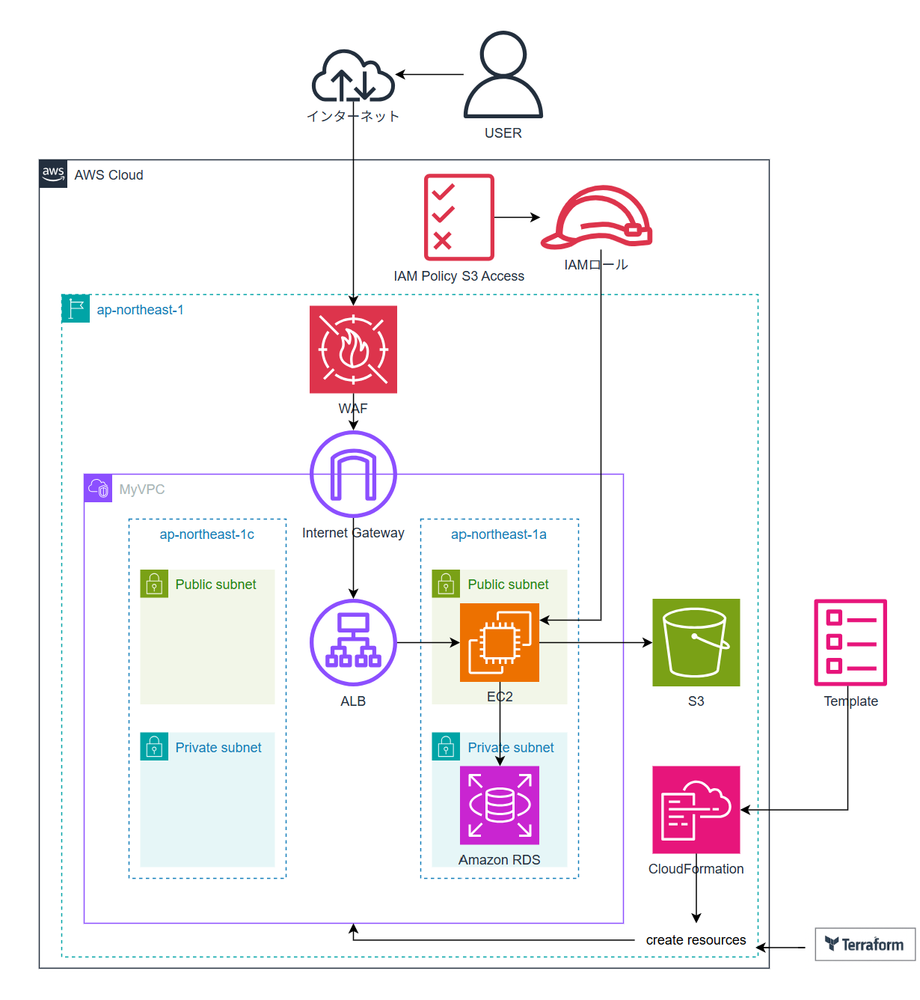

# Portfolio Infrastructure

このリポジトリは、AWS 上でのインフラ構築を目的としたポートフォリオです。  
Terraform と CloudFormation の2つの手法を用いて、同等の構成をそれぞれ異なるIaCツールで構築しています。

---

## 📷 アーキテクチャ図

---

## 🔧 使用技術・サービス

- **AWS**
  - VPC, Subnet, Internet Gateway, Route Table
  - EC2, RDS (MySQL), ALB, WAF
- **Infrastructure as Code**
  - Terraform
  - AWS CloudFormation
- **その他**
  - VS Code + WSL (Ubuntu)
  - GitHub

---

## 📌 各ディレクトリについて

### `terraform/`[Terraform 構成はこちら](./chapter-33/)

- モジュール構成を採用し、環境ごとの分割がしやすい構成
- S3 バックエンドや WAF の構成も含む
- また、セキュリティについての学習もREADMEにてまとめています。
- 実行結果は `terraform/README.md` を参照

### `cloudformation/`[CloudFormation 構成はこちら](./cloudformation/)

- YAML形式で構成を定義
- スタック単位で管理可能なシンプルな構成
- 実行結果は `cloudformation/README.md` を参照

### `aws-monitoring-logs-overview/`[監視・ログサービスの概要はこちら](./aws-monitoring-logs-overview/)

- AWSの監視・ログ関連サービス（CloudTrail, Config, CloudWatch など）の役割をまとめた学習用ドキュメント
- Mermaid記法によるサービス連携図を含み、構成全体を視覚的に理解可能
- 各サービスの概要、ユースケース、構成例（サービス一覧表）を記載

---

## ✅ 学習目的と工夫点

- IaC の理解を深めるために Terraform と CloudFormation 両方で同じ構成を作成
- セキュリティを考慮し、WAF や非公開の RDS 構成を採用
- モジュール化により、再利用性とメンテナンス性を意識

---
