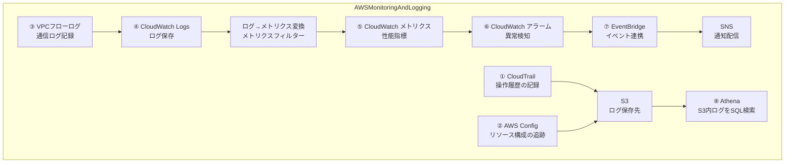

# AWS監視・ログ関連サービスの概要

本ドキュメントでは、AWSでの監視・ログ取得に関する主要なサービスの役割と特徴についてまとめています。インフラの運用・監視を行う上で理解しておくべきポイントを中心に記載しています。

---

## 監視＆ログのサービス一覧

| 番号 | サービス              | 主な役割                                 |
|------|-----------------------|------------------------------------------|
| ①    | CloudTrail            | 誰が・いつ・何をしたかの記録             |
| ②    | AWS Config            | リソース構成の変化を追跡                 |
| ③    | VPCフローログ         | ネットワーク通信の記録                   |
| ④    | CloudWatch Logs       | 各種ログデータの保存・可視化             |
| ⑤    | CloudWatch メトリクス | システム指標の可視化と監視               |
| ⑥    | CloudWatch アラーム   | 異常を検知して通知                       |
| ⑦    | EventBridge           | イベントのルールベース処理               |
| ⑧    | Athena                | SQLによるログの検索・分析               |

---

## 📊 ログ・監視サービス構成図

---

## 各サービスの詳細解説

### ① AWS CloudTrail

CloudTrailは **「誰が何をしたのか？」** に焦点を当てたログ記録サービスです。

- APIコールやコンソール操作など、AWSアカウント内で発生した操作を記録します。
- 操作ログはS3に保存され、監査やセキュリティ分析に役立ちます。

---

### ② AWS Config

Configは **「リソースがどのように変化したか？」** に焦点を当てたサービスです。

- EC2やセキュリティグループなど、AWSリソースの構成変更を時系列で追跡可能です。
- ルールベースのコンプライアンスチェックや構成の可視化に活用されます。

---

### ③ VPCフローログ

VPC内のネットワーク通信を記録するログサービスです。

- セキュリティ分析やトラブルシューティングに利用されます。
- VPC作成時に有効化しておくことが推奨されます（※有効化前の通信は取得できません）。
- ログの出力先はS3またはCloudWatch Logsが選択可能（**基本的にCloudWatch LogsでOK**）。

---

### ④ CloudWatch Logs

ログデータを保存・分析するサービスです。

- アプリケーションログのほか、VPC、RDS、LambdaなどのAWSサービスログも収集可能です。
- ログに対してクエリを実行することで、可視化やエラー分析も可能です。

---

### ⑤ CloudWatch メトリクス

各種AWSリソースから送信される **指標データ（メトリクス）** を収集します。

- **EC2インスタンス：** 標準およびカスタムメトリクスを利用可能。
- **RDSインスタンス：** 拡張モニタリングを有効にすると、OSレベルの詳細メトリクスも取得可能です。

---

### ⑥ CloudWatch アラーム

CloudWatch メトリクスに対して **しきい値を設定して監視** し、異常を検知するアラームを作成できます。

- 状態変化時にSNS通知、Lambda起動などのアクションが可能です。
- たとえば「CPU使用率80%以上で通知」など。

---

### ⑦ Amazon EventBridge

AWS内外のイベントをルールに基づいて処理する **イベントバスサービス** です。

- CloudWatchアラームやCloudTrailイベントなどをトリガーとして、SNSやLambdaなどに接続可能です。
- 例：`CloudWatch アラーム → EventBridge → SNS通知`
- **Scheduler機能** により、日時指定でLambda等を定期実行することも可能です。

---

### ⑧ Amazon Athena

Athenaは、**S3に保存されたデータに対してSQLクエリを実行できるサーバーレス分析サービス** です。

- CloudTrail、VPCフローログなどのログをSQLで直接分析できます。
- 手軽に高度な検索・集計が可能で、構造化ログの調査に非常に有効です。
