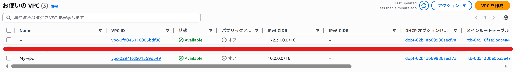
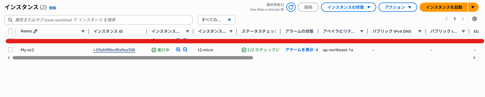
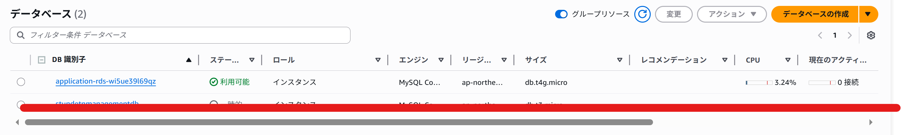
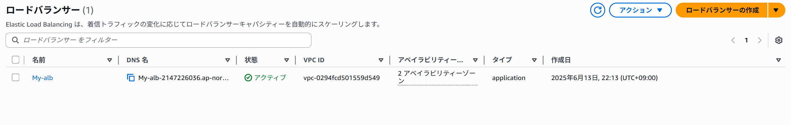

### `cloudformation/README.md`（CloudFormation専用）

# CloudFormation 構成

このディレクトリには、YAML 形式の AWS CloudFormation テンプレートが含まれています。

## 内容

- スタックテンプレート（VPC,EC2,RDS、ELBEC2,RDS、ELB）

## 実行結果

1,VPC確認

2,EC2確認

3,RDS確認

4,ELB確認
