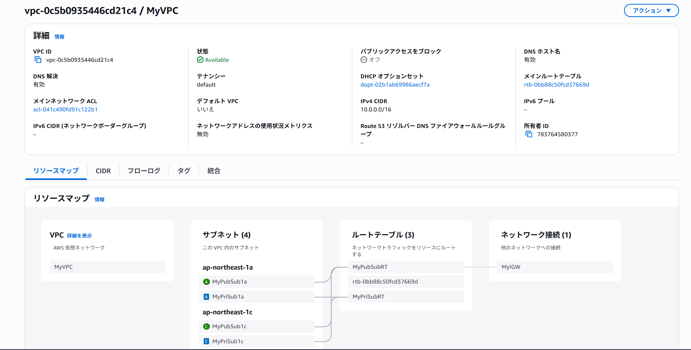
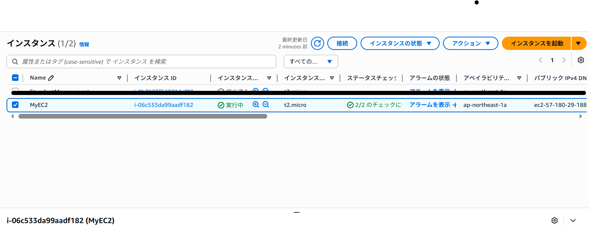
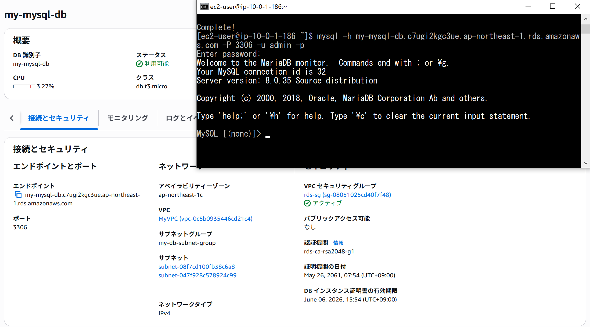
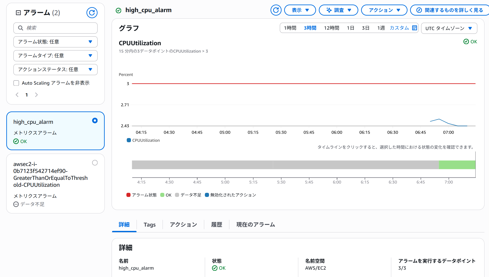
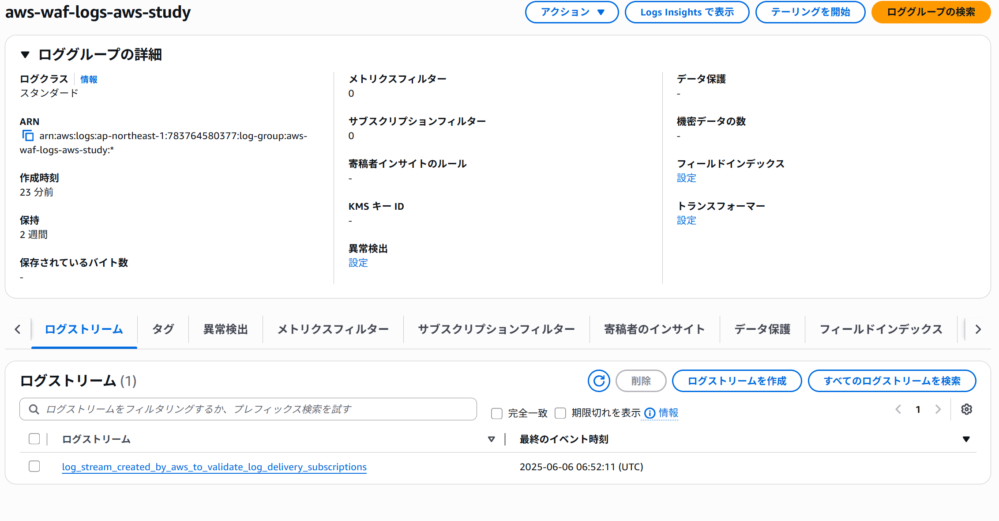
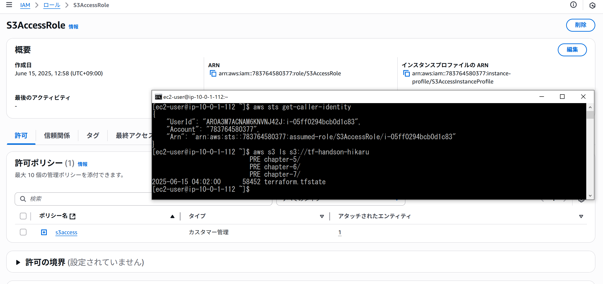

# Terraform 構成
このディレクトリには、Terraform を使った AWS インフラ構築コードが含まれています。

## 内容

- VPC、サブネット、EC2、RDS、ALB、WAF、、CloudWatchのリソース
- モジュール化された構成
- S3 バックエンドによる state 管理

## 実行結果

1,VPC確認

2,EC2確認

3,RDS確認

4,CloudWatch確認

5,Wafログ確認

6,IAMロール確認
